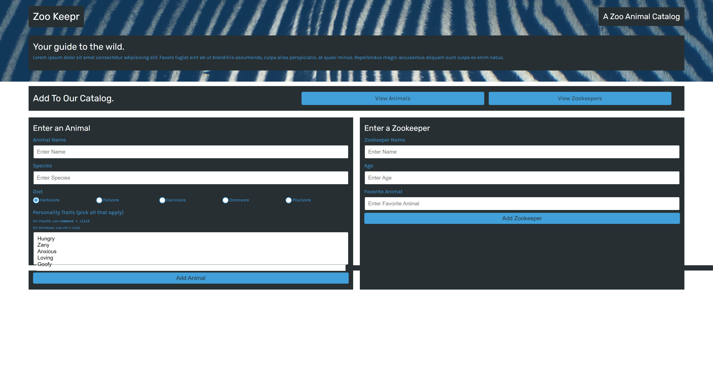
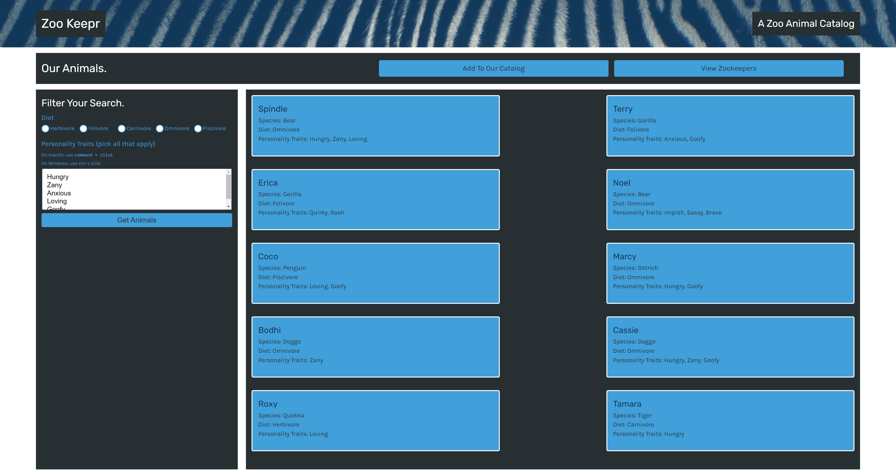
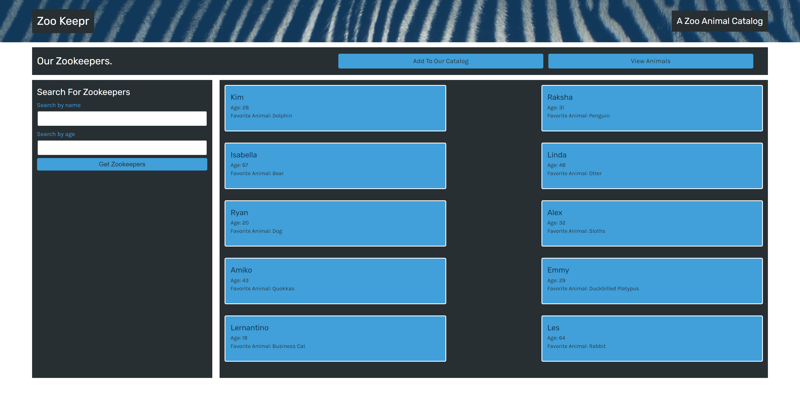

# Zookeeper

Created server-side APIs using Express.js framework to handle and respond to HTTP requests from clients. Handles GET and POST requests and parse parameters in server-side routes.

## Table of Contents

* [Setup](#setup)
* [Usage](#usage)
* [Tests](#tests)
* [Contributing](#contributing)
* [License](#license)

## Setup
:floppy_disk:

Fork or clone this repository and open the files within to access the command prompt.

Uses npm (Node Package Manager), Express.js and Heroku. Go to [Node's website](https://nodejs.org/en/) and follow the download instructions for your appropriate setup. NPM, or Node Package Manager, is the default package manager for Node.js. It is distributed with Node.js. Do not forget to npm init if you are using it for the very first time.

Check that your system has the following programs:
- [Node Package Manager](https://nodejs.org/en/)
  - Run `npm install` in order to install the following npm package dependencies as specified in the `package.json`.
  - This will also help install express on your system and manage any other dependencies in your script.
- [Express](https://www.npmjs.com/package/express)
  - Express is a back end web application framework for Node.js. Released as free and open-source software under the MIT License. Designed for building web applications and APIs. Many users use it as a standard server framework for Node.js.
- [Jest](https://www.npmjs.com/package/jest)
  - A testing framework designed to ensure correctness of any JavaScript codebase.

`npm init`

`npm install express`

`npm install --save-dev jest`

You can set up the server by using Heroku:
- [Heroku](https://devcenter.heroku.com/articles/heroku-cli)
  - Heroku Command Line Interface(CLI) to manage Heroku apps directly from the terminal. Requires Git to install the client.
  - In Git, go to your local terminal and type `heroku create`.
  - If at any point the files are changed, you can add the changed files to Heroku. Deployment steps rely on Git branch. Type:
    - `git add -A`
    - `git commit -m "Description"`
    - `git push heroku main` (Type `git push heroku `[branch]`:main` if deployed in a local branch)
  - Ensure that your server is in the correct PORT.
  - For more documentation, see [Heroku Documentation](https://devcenter.heroku.com/categories/reference).

Start the server by running `npm start` in the command line.

## Usage

:computer:

Run `npm start` in the command line to start the server.

Either use Heroku (In Git, type `heroku open` to find your website server), or `http://localhost:3001/` to open up the site. Localhost server is contingent on your code.

- View a list of animals on Zooper.
- Enter a new animal into the database.
- Add a new Zookeeper in to the database.
- Filter your searches within the animal/zookeeper database.
- Travel between hosted pages.

## Tests

:gear:

To run tests in this project, open up the terminal associated with the files. Ensure that C:\filePath is in the correct location. Be sure to have all files associated with `npm` and `jest` installed.

Within the terminal, you can type the following commands to activate the tests:

`npm run test`

## Contributing

:octocat:

[paperpatch](https://github.com/paperpatch)

## License

:receipt:

This project is licensed under MIT.